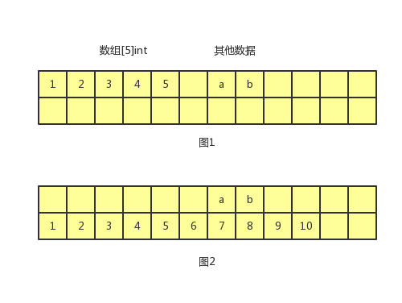

> 字符串拼接在golang中是非常常见的操作,本文介绍几种常用方法并分析各种方法的效率.

## 拼接

###  + 号拼接
**+** 号拼接是最常见的方式
```go
var a string = "Hello,"
var b string = "World!"
func Test1() string {
	return a + b
}
```

### buffer拼接
**bytes** 库提供一个结构体 **Buffer**, **Buffer**结构允许多次写入**[]byte** 、**string** 、**rune**类型的数据并一次性输出
```go
var a string = "Hello,"
var b string = "World!"
func Test2() string {
	var buffer bytes.Buffer
	buffer.WriteString(a)
	buffer.WriteString(b)
	return buffer.String()
}
```
### fmt.Sprint()格式化
**fmt** 库提供的 **SprintX()** 系列函数可以返回格式化后的字符串,也可用来做拼接操作
```go
var a string = "Hello,"
var b string = "World!"
func Test3() string {
	return fmt.Sprint(a, b)
}
```
### append拼接
字符串的底层是数组,而数组的拼接可以使用 **append()**,因此可以利用这一特性来进行字符串拼接操作.
```go
var a string = "Hello,"
var b string = "World!"
func Test4() string {
	return string(append([]byte(a), []byte(b)...))
}
```

## 性能
以上介绍了比较常见的几种拼接方式,但是究竟哪种效率更高呢?下面针对 **单次拼接** 做一个测试,将上述代码保存为plus.go.
```go
package plus
import (
	"bytes"
	"fmt"
)
var a string = "Hello,"
var b string = "World!"

func Test1() string {
	return a + b
}

func Test2() string {
	var buffer bytes.Buffer
	buffer.WriteString(a)
	buffer.WriteString(b)
	return buffer.String()
}

func Test3() string {
	return fmt.Sprint(a, b)
}

func Test4() string {
	return string(append([]byte(a), []byte(b)...))
}
```

然后编写测试脚本plus_test.go.
```go
package plus_test

import (
	p "plus"
	"testing"
)

func BenchmarkTestPlus(b *testing.B) {
	for i := 0; i < b.N; i++ {
		p.Test1()
	}
}

func BenchmarkTestBuffer(b *testing.B) {
	for i := 0; i < b.N; i++ {
		p.Test2()
	}
}

func BenchmarkTestFormat(b *testing.B) {
	for i := 0; i < b.N; i++ {
		p.Test3()
	}
}

func BenchmarkTestAppend(b *testing.B) {
	for i := 0; i < b.N; i++ {
		p.Test4()
	}
}
```
运行性能测试代码 `go test stringplus_test.go -bench=.` 结果如下:
* goos: darwin
* goarch: amd64
* BenchmarkTestPlus-8     	100000000	        22.2 ns/op
* BenchmarkTestBuffer-8   	20000000	       102 ns/op
* BenchmarkTestFormat-8   	10000000	       191 ns/op
* BenchmarkTestAppend-8   	50000000	        26.4 ns/op

然后得出做一个排序,**单次拼接**运行时间:
`+` < `append()`< `bytes.Buffer` < `fmt.Sprint()`

## 分析

### + 与 append()性能分析
`+`运算符为系统底层提供,无法一窥究竟.但可以由此来推断其余几种方式的运行过程, 字符串的底层是数组,姑且猜测 `+`方法底层就`append(a,b)` 的方式实习.

来看 `append()` 方式, 拼接期间进行了两次类型转换,分别是
1. 字符串 `a,b` 转换成 `[]byte`类型.
2. `append()`拼接后 `[]byte`类型转为`string`

`append()`执行时间与`+`差距不大,由此可以推测出时间浪费在类型转换上.做一个验证:

```
var a string = "Hello,"
var b string = "World!"
var c = []byte{72, 101, 108, 108, 111, 44}
var d = []byte{87, 111, 114, 108, 100, 33}

func Test1() string {
	return a+b
}

func Test5() []byte {
	return append(c, d...)
}
```
结果出乎意料,速度反而不如转换类型后进行`append()`然后再转换.
goos: darwin
goarch: amd64
* BenchmarkTestPlus-8         	100000000	        22.0 ns/op
* BenchmarkTestAppend-8       	50000000	        26.0 ns/op
* BenchmarkTestAppendByte-8   	50000000	37.6 ns/op

查看`append()`位于 `src/builtin/builtin.go` 的注释得知:
1. 对于`[]slice`拼接, 有 `len` 和 `cap`两个属性,并且涉及底层数组.
2. 如果切片容量够则直接拼接,如果不够,先扩容容量再拼接.
3. 当容量不足时,会先尝试扩容切片,如果没有连续的内存空间可以扩容,会在新的内存空间建立扩容后的切片,再将原切片拷贝过去.

### append byte性能分析
原因在于数组的 **容量**,看下面这个例子, `e,f`分别为转换为`[]byte`类型的`a,b`字符串
```go
var a string = "Hello,"
var b string = "World!"
var c = []byte{72, 101, 108, 108, 111, 44}
var d = []byte{87, 111, 114, 108, 100, 33}
e := []byte(a)
f := []byte(b)
fmt.Println("c的长度:", len(c), "容量:", cap(c))
fmt.Println("d的长度:", len(d), "容量:", cap(d))
fmt.Println("e的长度:", len(e), "容量:", cap(e))
fmt.Println("f的长度:", len(f), "容量:", cap(f))
```

输出结果如下:
* c的长度: 6 容量: 6
* d的长度: 6 容量: 6
* e的长度: 6 容量: 32
* f的长度: 6 容量: 32

可以看到,利用`[]byte()`类型转换后的切片`e,f`,容量为32,而直接定义的切片 `c,d`容量仅仅为6,因此,在拼接的时候,`c`需要先扩容,然后再拼接,而扩容时,又会遇到迁移的问题,于是乎花费的时间反而更多.

### 切片迁移(拷贝)
如图1,一片连续的内存片中定义了`[5]int`和其他数据.当底层为`[5]int`的切片要拼接 `6,7,8,9,10`时,由于容量不够,需要扩容.可由于后续的内存地址被其他数据占据,无法形成连续的内存地址.所以会发生迁移操作.

如图2,数组在新的内存地址中申请一块长度为原容量 `2倍`的一块内存地址,再将原始数据拷贝过去.



### fmt.SprintX()性能分析
`fmt`库中函数,允许输入任意类型的数据,所以参数类型都是`interface{}`,上述例子中使用的`Sprint()`签名如下:
```go
func Sprint(a ...interface{}) string{}
```
但是在底层需要输出的时候,由于无法确定参数具体类型,于是借助了反射,`src/fmt/print.go`有具体实现,关键部分代码如下:
```go
// Some types can be done without reflection.
	switch f := arg.(type) {
	case bool:
		p.fmtBool(f, verb)
	case float32:
		p.fmtFloat(float64(f), 32, verb)
	case float64:
		p.fmtFloat(f, 64, verb)
	case complex64:
		p.fmtComplex(complex128(f), 64, verb)
	case complex128:
		p.fmtComplex(f, 128, verb)
	case int:
		p.fmtInteger(uint64(f), signed, verb)
	case int8:
		p.fmtInteger(uint64(f), signed, verb)
	case int16:
		p.fmtInteger(uint64(f), signed, verb)
	case int32:
		p.fmtInteger(uint64(f), signed, verb)
	case int64:
		p.fmtInteger(uint64(f), signed, verb)
	case uint:
		p.fmtInteger(uint64(f), unsigned, verb)
	case uint8:
		p.fmtInteger(uint64(f), unsigned, verb)
	case uint16:
		p.fmtInteger(uint64(f), unsigned, verb)
	case uint32:
		p.fmtInteger(uint64(f), unsigned, verb)
	case uint64:
		p.fmtInteger(f, unsigned, verb)
	case uintptr:
		p.fmtInteger(uint64(f), unsigned, verb)
	case string:
		p.fmtString(f, verb)
	case []byte:
		p.fmtBytes(f, verb, "[]byte")
	case reflect.Value:
		// Handle extractable values with special methods
		// since printValue does not handle them at depth 0.
		if f.IsValid() && f.CanInterface() {
			p.arg = f.Interface()
			if p.handleMethods(verb) {
				return
			}
		}
		p.printValue(f, verb, 0)
	default:
		// If the type is not simple, it might have methods.
		if !p.handleMethods(verb) {
			// Need to use reflection, since the type had no
			// interface methods that could be used for formatting.
			p.printValue(reflect.ValueOf(f), verb, 0)
		}
	}
```
反射部分涉及`reflect`库,因此速度会比底层数据操作慢很多.

### bytes.Buffer性能分析
来看`WriteString()`函数内部实现, 内部实现与`append()`类似,每次都需要执行`tryGrowByReslice()`来判断是否扩容,然后调用`copy()`内置函数来进行拷贝,因此拖慢了速度,但由于不涉及其他库,所以速度会快于`fmt`系列.

```go
func (b *Buffer) WriteString(s string) (n int, err error) {
	b.lastRead = opInvalid
	m, ok := b.tryGrowByReslice(len(s))
	if !ok {
		m = b.grow(len(s))
	}
	return copy(b.buf[m:], s), nil
}
```

## 总结
1. 对于简单的拼接,使用`+`最为便捷高效.
2. 对于字符串与其他类型底层类型拼接,使用 **类型转换** 配合`append()`的方式比较好.
3. 对于复杂的拼接,`fmt.SpintX()`与`bytes.Buffer`均可,前者类型支持的多一些,后者速度更快一点.


